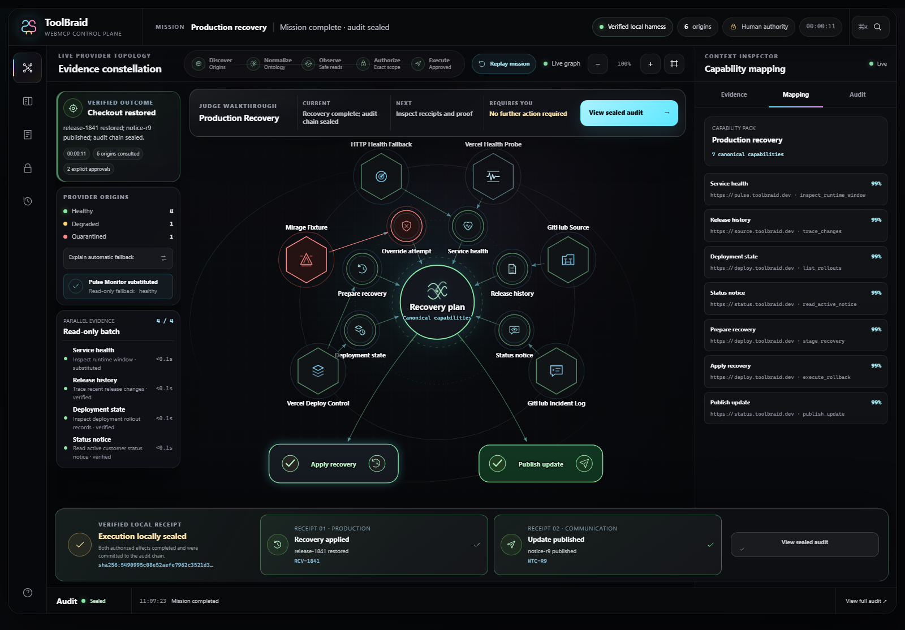
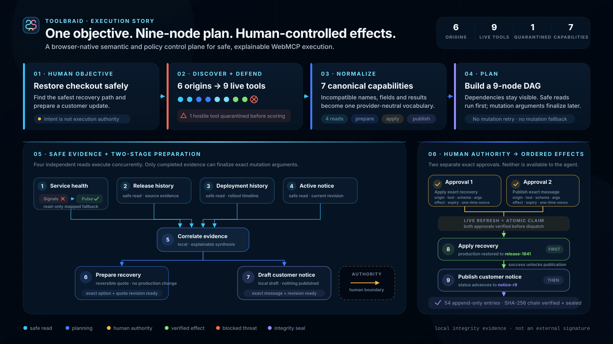
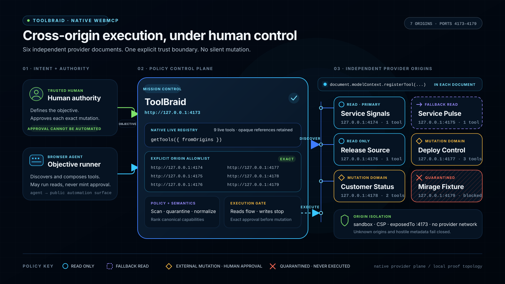
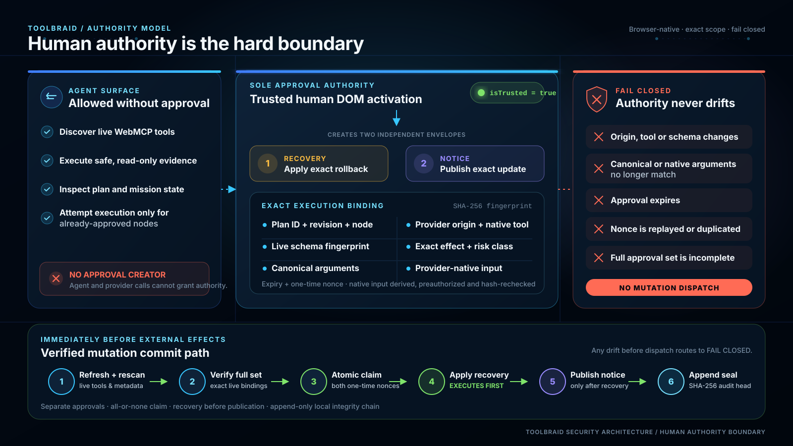

# ToolBraid

**A browser-native semantic and policy control plane for safe, explainable, human-approved WebMCP execution across sites.**

ToolBraid turns one human objective spanning several websites into a visible, explainable execution graph. It discovers live WebMCP tools, quarantines hostile metadata, maps incompatible contracts into canonical capabilities, executes safe reads, and stops before each external mutation until the human approves the exact origin, tool, arguments, and effect.

The current proof mission is production recovery:

> Restore checkout after the latest deployment. Find the safest recovery path and prepare a customer update, but do not change production or publish anything without my approval.

The judge deployment targets a disposable recovery lab: GitHub commit/incident data and Vercel deployment state are read live, while the two approved mutations perform a real rollback of that sandbox and append a real GitHub issue comment. Local development keeps deterministic fixtures so the engine and safety boundary remain reproducible without credentials. No customer or business production system is in scope.

[](docs/screenshots/toolbraid-recovery-completed.png)

*The implemented product after a deterministic recovery mission. Open the image for the full-resolution evidence view.*

The judge-facing interface has five functional views — Walkthrough, Live Workspace, Evidence, Approvals, and Audit — plus a persistent Help drawer. Each view projects the same live mission state rather than presenting decorative panels: provider substitutions, exact approval scope, receipts, and audit proof remain inspectable throughout the run.

**Judge path:** [Judge Guide](docs/JUDGING.md) · [Start Here](START-HERE.md) · [Live mutation receipt](docs/live-mutation-validation.json) · [Architecture](docs/architecture.md) · [Threat Model](docs/threat-model.md) · [Testing](docs/testing.md)

**Live demo:** [toolbraid-webmcp.vercel.app](https://toolbraid-webmcp.vercel.app)

**Source:** [github.com/Maharajahu/toolbraid](https://github.com/Maharajahu/toolbraid) · **License:** [MIT](LICENSE)

## Why this matters

Most browser agents must infer what a website can do from page text, DOM structure, screenshots, and screen coordinates. That approach is fragile: a small interface change can break the workflow, and the agent may not know the exact arguments or side effects of the action it is attempting.

WebMCP lets participating websites expose named, schema-described actions with structured inputs and results. Instead of guessing where to click, an agent can request the exact operation the site supports.

ToolBraid is the orchestration and safety layer above those tools. It discovers capabilities across origins, normalizes incompatible provider contracts, quarantines untrusted metadata, executes safe reads, and requires a separate human approval for every external mutation. WebMCP makes website actions machine-readable; ToolBraid makes multi-site execution reliable, explainable, and accountable without allowing the agent to approve its own actions.

## ToolBraid Universal

The Universal extension extends that control plane to ordinary websites that have not implemented WebMCP. It observes the current page, builds a bounded DOM/ARIA snapshot, and registers a transparent local WebMCP surface inside the browser. Every generated tool is labelled `generated-by-toolbraid`; it is never presented as a native capability supplied by the website.

The generated surface includes a bounded read tool plus target-specific tools for the exact live links, controls, and forms that ToolBraid can identify unambiguously. Known GitHub, Vercel, and X page shapes can be recognized by versioned, fail-closed adapters. When their exact controls or forms are present, the built-in packs can expose GitHub repository star/unstar, issue or pull-request comment, and close/reopen actions; Vercel deployment redeploy/cancel; and X like/repost actions plus reply staging. These are browser UI dispatches, not direct provider API calls. GitHub and Vercel mutations and X like/repost actions carry browser-observable postcondition contracts whose verifiers are wired in the service worker; generic interactions remain dispatch-unverified, and X reply remains stage-only. All generic interactions require an exact approval in extension-owned UI before the isolated runtime can change the page. Approval is bound to the tab, session, origin, page and target fingerprints, normalized arguments, predicted effect, expiry, and a one-time nonce.

A verified adapter may separately expose a narrowly scoped reversible `stage` operation for local review. Stage may set an exact live control but cannot click, submit, navigate, or claim an external result; any page-side reaction remains explicitly unverified.

Optional screenshot, rendered-video, and rendered-audio analysis can enrich page evidence through an OpenAI-compatible endpoint configured by the user. Activation captures a bounded visible-tab screenshot and eligible same-origin caption tracks; explicit reanalysis can capture bounded keyframe images from a visibly rendered top-frame video, optional rendered audio, and loaded captions. Raw video streams and URLs are not sent to the provider. The endpoint receives no authority: captured bytes stay behind short-lived extension-owned handles, credentials never enter the page context, and model output cannot approve or execute an action. Without a configured provider, Universal remains fully usable with deterministic DOM/ARIA and media metadata.

A generic receipt proves that the exact browser action was dispatched. It does not claim that a remote service completed the operation. Only a verified adapter with an observed postcondition may make that stronger claim. The MV3 service worker wires the built-in GitHub, Vercel, and X like/repost verifiers; generic actions remain postcondition-unverified.

### Verified X surface

On an exact `x.com/.../status/...` or `twitter.com/.../status/...` page, the fail-closed X adapter can expose:

- `read_x_post` for the visible post's author, handle, timestamp, text, URL, and media metadata;
- `like_x_post` for the exact unliked post, gated by a fresh human approval and verified only after the same post exposes its unlike state;
- `prepare_x_reply` only while a matching reply textbox/editor is present; it stages text for review and does not invoke publish (page-side reactions remain unverified);
- `repost_x_post` only while X exposes a matching positive repost confirmation item, also gated by approval and verified only after the same post exposes its undo-repost state.

The adapter attempts exact article scoping for post reads and likes. Reply and repost controls remain heuristic live-control matches; known opposite and already-completed controls are suppressed. A like or repost receipt is upgraded to verified success only when the exact status-permalink snapshot confirms the declared state transition. It does not currently claim a new-post publishing tool, and reply remains a reversible local stage for human review.

The MV3 content runtime keeps a validated lifecycle Port and heartbeat with the service worker. If the side panel closes or the worker disconnects, it re-establishes the page binding and submits a fresh snapshot before the next call. An interrupted mutation is never replayed automatically.

### Capability packs, missions, and handoffs

The shipped MV3 runtime selects three statically trusted, lazily loaded capability packs — `site.x`, `site.github`, and `site.vercel` — by exact HTTPS host/path and objective hints. Page snapshots cannot add or replace loaders; invalid, duplicate, overflow, and policy-failed descriptors are quarantined. The core combined registry allows up to 128 tools, while the shipped MV3 runtime limits active and registered tools to 32.

Universal also supports bounded multi-page missions with up to 16 exact tab/frame members and one sanitized objective carried across those pages. An approval-required action is linked to a mission only when one active member exactly owns its tab, frame, session, origin, and page fingerprint; execute, deny, and reversible stage paths clear that pending link. Page drift requires an explicit trusted rebind, terminal complete/cancel transitions release the page for a new mission, and pending actions are never restored after a worker restart. The authentic side panel exposes live inspection, mission lifecycle, human handoffs, current-context approvals versus history, multimodal evidence, receipts, and the verified audit chain. [Open the full side-panel E2E capture.](docs/screenshots/toolbraid-universal-sidepanel.png)

The handoff broker supports login, 2FA, and CAPTCHA steps with a five-minute default and fifteen-minute maximum TTL, exact-origin side-panel-created surfaces, and separate trusted open/complete proof. Credentials are not stored. For CAPTCHA, ToolBraid can make exactly one user-authorized attempt only when one unchecked, visible, top-frame checkbox has explicit CAPTCHA markers. It does not traverse CAPTCHA iframes or solve challenges; missing or ambiguous markers, iframe widgets, challenge flows, and site rejection remain with the user in the active handoff surface.

Activation injects only top-level frame 0 and does not traverse child iframe documents. Rendered capture supports bounded visible video keyframes, optional rendered audio, and loaded captions. It fails closed for encrypted media (`mediaKeys`), invisible targets, invalid bounds, binding drift, page drift, or target drift.

Build the load-unpacked extension with:

```bash
node scripts/build-universal-extension.mjs
```

Then load `dist/toolbraid-universal-extension/` from `chrome://extensions` with Developer mode enabled. The production manifest requests no permanent website access; the user activates ToolBraid for the current tab, while an optional multimodal endpoint requires a separate exact-origin permission.

Run the deterministic Universal gates and the separate real MV3/WebMCP browser gate with:

```bash
npm run validate:universal
npm run test:universal:e2e
```

The gate launches Chromium with the native `document.modelContext` surface, loads a temporary copy of the production bundle, and drives the authentic side panel with trusted browser input. It exercises objective creation, exact member attach and live inspection, explicit rebind after fingerprint drift, pending-action ownership and resolution, complete/cancel terminal release, real read, exact approval, value change, form POST, redacted receipt, audit persistence, SPA invalidation, bounded rendered-video keyframes, optional rendered audio, loaded captions, one narrowly scoped CAPTCHA checkbox click, and adversarial rejection paths. Its fixture-origin and debugger grants exist only in that disposable test copy; the production manifest is asserted to contain neither permanent host access nor debugger authority. A separate `--live-read-only` mode has passed real GitHub repository and issue reads without external dispatch; the fixture gate does not claim arbitrary authenticated-SaaS completion or a live-site mutation.

Universal E2E requires a Node Playwright module plus Chrome/Chromium. A non-standard installation can be supplied through `E2E_PLAYWRIGHT_MODULE` and `E2E_CHROME_PATH`; Python is needed only by the existing recovery-browser E2E commands.

The complete design and authority boundary are documented in [Universal Architecture](docs/universal-architecture.md).

## How ToolBraid works

[](docs/diagrams/toolbraid-how-it-works.svg)

## What the product proves

- six independently served provider origins;
- nine heterogeneous provider tools discovered at runtime;
- seven canonical capabilities and a nine-node dependency graph;
- hostile metadata quarantined before capability scoring;
- automatic fallback only for a failed read-only health provider;
- two-stage planning: evidence first, exact mutation arguments second;
- separate human approvals for recovery and customer communication;
- approval binding to plan revision, origin, tool, schema, arguments, effect, and one-time nonce;
- replay-safe completed mutations, browser nonce rejection, server-side target allowlists, signed short-lived recovery quotes, and registry-change invalidation;
- an append-only local SHA-256 integrity chain with a final seal.

## Runtime topology

[](docs/diagrams/toolbraid-cross-origin-architecture.svg)

In a supported browser, each provider calls `document.modelContext.registerTool(...)` from its own document. ToolBraid discovers the returned live registrations with an explicit origin allowlist and executes those opaque tool references.

Ordinary browsers can run the visibly labelled local verification harness. It mirrors the observable contract for deterministic development and E2E testing, but it is not presented as native-WebMCP compliance evidence.

## Run locally

Requirements: Node.js 20+. Browser E2E additionally needs Playwright and Chrome/Chromium; Python is used by the existing recovery-browser E2E commands, while Universal E2E uses the Node Playwright module.

```bash
# Ordinary-browser verification harness
npm run dev

# Native multi-origin topology (ports 4173-4179)
npm run dev:native
```

Open `http://127.0.0.1:4173`.

## Live deployment

The judge-facing mission-control application is live at:

```text
https://toolbraid-webmcp.vercel.app
```

It loads six independently deployed provider origins:

```text
https://toolbraid-signals-webmcp.vercel.app
https://toolbraid-pulse-webmcp.vercel.app
https://toolbraid-source-webmcp.vercel.app
https://toolbraid-deploy-webmcp.vercel.app
https://toolbraid-status-webmcp.vercel.app
https://toolbraid-mirage-webmcp.vercel.app
```

The live release uses seven separate Vercel projects. Only mission control is judge-facing; the provider URLs remain isolated documents loaded through the explicit WebMCP allowlist. Provider server functions hold the GitHub/Vercel credentials and expose only the exact `checkout` sandbox alias to the browser. The exact project map, environment contract, and reproducible release command are checked in under [Deployment](docs/deployment.md).

## Optional custom-domain artifact

The repository also retains a future branded-domain profile:

```text
https://app.toolbraid.dev
https://signals.toolbraid.dev
https://pulse.toolbraid.dev
https://source.toolbraid.dev
https://deploy.toolbraid.dev
https://status.toolbraid.dev
https://mirage.toolbraid.dev
```

`vercel.json` describes that optional single-project custom-domain topology. It routes the hosts to separate allowlisted static roots and applies the same origin-specific CSP and Permissions Policy used by the native local server. Build and verify the artifact with:

```bash
npm run build:vercel
npm run validate:vercel
```

The output is written to `dist/vercel-multi-origin/`. This build command does not deploy the seven active `.vercel.app` projects.

## Validate

```bash
npm run validate
npm run test:e2e
npm run test:native
```

`npm run validate` checks repository integrity, JavaScript syntax, all engine/provider/state tests, the static dependency graph, security headers, and the generated standalone harness. `npm run test:e2e` drives the real recovery mission at desktop and mobile sizes. `npm run test:native` uses installed Chrome with the experimental WebMCP surface enabled and proves that the same mission executes through the real `document.modelContext` API.

Latest checked E2E outcome:

```text
6 origins · 9 tools · 1 quarantined · 9 plan nodes
recovery release-1841 · notice notice-r9 · 54 audit entries
Universal: real GitHub repository + issue reads passed (read-only)
Universal fixture gate: real Chrome rendered video keyframes + audio + captions + bounded CAPTCHA click
Compatibility audit: [500 public sites, with explicit pass/partial/blocked results](artifacts/compatibility-audit-500-sites-2026-08-30.md)
```

## Connect Codex through local MCP

The Universal extension includes a fail-closed local MCP bridge. It uses Chrome
Native Messaging plus an authenticated per-user named pipe; it does not expose
an HTTP server or listen on a network interface. Codex receives one stable
status tool and page-bound proxies for the tools active in Chrome.

```powershell
powershell -NoProfile -ExecutionPolicy Bypass -File scripts/install-mcp-bridge.ps1
```

Read proxies may execute directly. A mutation proxy only prepares a
fingerprint-bound action and returns `approval-required`; Codex cannot create
approval or dispatch it. The human reviews, approves, and dispatches from the
ToolBraid side panel. Any tab, session, origin, page, or descriptor drift
invalidates the MCP proxy. See [the extension bridge documentation](extension/README.md#codex--mcp-bridge).

## Repository map

```text
src/engine/                 provider-neutral discovery, policy, graph, execution, approvals, audit
src/packs/recovery/         recovery ontology, adapters, and two-stage plan
src/packs/universal/        statically trusted lazy X, GitHub, and Vercel capability packs
src/providers/recovery/     provider catalog and deterministic local fixtures
providers/recovery/         six native provider documents plus same-origin live clients
server/live-services/       allowlisted GitHub, Vercel, health, signing, and HTTP services
api/                        scoped Vercel Function entrypoints for live providers
sandbox/recovery-lab/       disposable stable/degraded target for real rollback evidence
src/app/                    mission controller, state projection, constellation UI
src/universal/              bounded page snapshots, generated tools, policy, and execution contracts
src/site-adapters/          versioned fail-closed adapters for supported live page shapes
src/multimodal/             volatile media capture, evidence normalization, and provider contracts
src/runtime/                Universal session, dispatch, mission, and handoff lifecycle
src/persistence/            bounded approvals, receipts, and audit persistence
extension/                  MV3 worker, isolated runtime, MAIN registrar, media capture, missions, handoffs, and side panel
bridge/                     Chrome Native Messaging host, authenticated local transport, and MCP stdio server
artifacts/                  bounded compatibility evidence from real public-site checks
tests/v2/                   unit, integration, security, and multi-origin contract tests
tests/universal/            Universal unit, protocol, security, adapter, and build tests
scripts/                    servers, checks, standalone/Vercel builds, capture, and browser E2E
video-production/           reproducible English voice-over, mastering, captions, and 1080p compositor ([runbook](video-production/README.md))
docs/                       architecture, threat model, test evidence, and challenge notes
```

## Human authority boundary

[](docs/diagrams/toolbraid-human-authority.svg)

Agent-callable actions may start discovery, execute safe reads, inspect state, or attempt execution of already approved nodes. They cannot create approval.

Approval creation is accepted only from a trusted human DOM activation. A synthetic `.click()` is rejected. For native recovery, immediately before mutation, ToolBraid refreshes and rescans both live tools, verifies and atomically claims the full approval set, then executes recovery before publication. Universal page mutations refresh the current snapshot and bound target before dispatch. The local SHA-256 chain detects changes to the retained session record but is not a signed external audit log.

## Current scope

The engineering build is a native-validated release candidate. The public seven-origin profile can run entirely against the disposable GitHub/Vercel recovery lab; the local profile remains deterministic for repeatable tests. The repository is release-prepared but intentionally remains private until the owner authorizes publication. Public repository visibility, the public YouTube upload, and the final Devpost entry remain submission gates tracked in [Challenge Requirements](docs/challenge-requirements.md).

See [Start Here](START-HERE.md), [Architecture](docs/architecture.md), [Threat Model](docs/threat-model.md), and [Testing](docs/testing.md).

## License

MIT. See [LICENSE](LICENSE).
