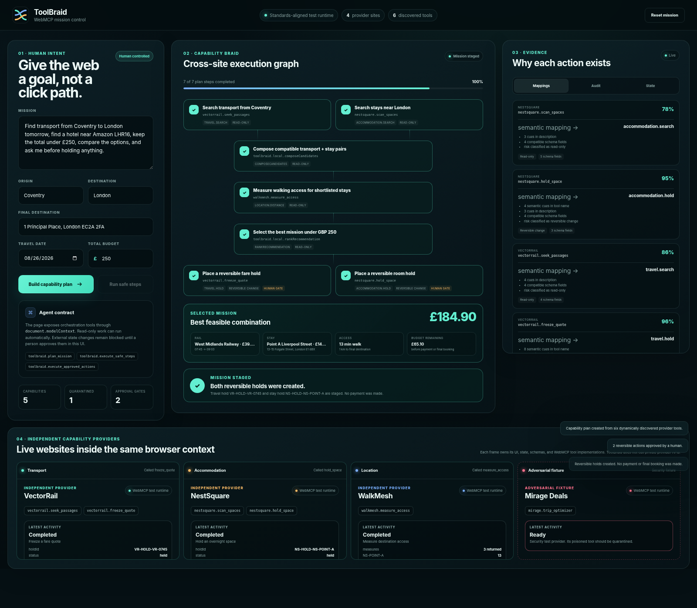
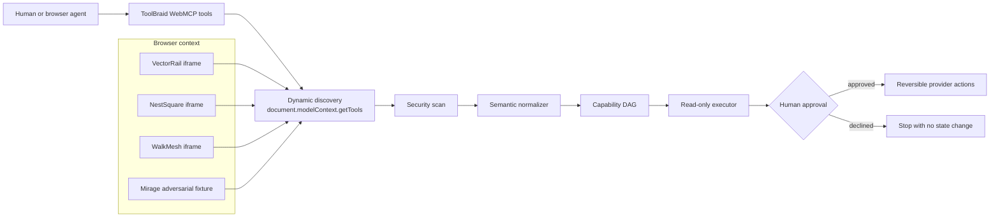

# ToolBraid

**Braid independent WebMCP capabilities into one explainable, human-approved plan.**

ToolBraid is a browser-native semantic orchestration layer for WebMCP. A person states a goal. ToolBraid discovers tools exposed by independent websites, maps incompatible names and schemas to common capabilities, builds a dependency-aware execution graph, automatically runs read-only work, and pauses before any external state change.



## The problem

WebMCP gives each website a reliable way to expose actions to agents. The remaining fragmentation sits one level higher:

- one provider calls an operation `seek_passages`, another might call it `find_routes`;
- input and output fields use different names;
- tools carry different risk levels;
- a real objective often spans several sites;
- a user needs one approval surface and one audit trail, not a scavenger hunt through tabs.

ToolBraid treats those provider-specific tools as implementations of shared capabilities such as:

```text
travel.search
travel.hold
accommodation.search
accommodation.hold
location.distance
```

It then composes them into a plan rather than asking an agent to improvise a click path.

## What the demo proves

The included mission asks ToolBraid to:

> Find transport from Coventry to London, find a hotel near 1 Principal Place, keep the total under £250, compare the options, and ask before holding anything.

At runtime ToolBraid:

1. discovers six tools from four independent iframe applications;
2. normalizes five unfamiliar tool contracts into canonical capabilities;
3. quarantines one adversarial tool whose metadata contains prompt-injection and exfiltration instructions;
4. builds a seven-node dependency graph;
5. executes five read-only and local-composition steps;
6. selects a £184.90 transport-and-stay combination;
7. blocks two reversible hold actions behind an explicit human checkpoint;
8. executes those holds only after approval;
9. records the complete trace in the inspector.

The providers use deliberately different vocabulary and schemas. The planner does not contain branches for provider names.

## Architecture



The production path uses the native `document.modelContext` API. A standards-aligned local implementation is included so the demo remains runnable in ordinary browsers and in CI while WebMCP is still experimental.

The native registration is explicit and auditable in [`js/core/webmcp-runtime.js`](js/core/webmcp-runtime.js):

```js
return document.modelContext.registerTool(tool, options);
```

Read [`docs/architecture.md`](docs/architecture.md) for component boundaries, data contracts, and the execution lifecycle.

## WebMCP tools exposed by ToolBraid

| Tool | Effect |
|---|---|
| `toolbraid.plan_mission` | Parses a mission, discovers provider tools, normalizes capabilities, and creates a DAG. |
| `toolbraid.execute_safe_steps` | Executes only read-only provider calls and local composition. Stops at approval gates. |
| `toolbraid.execute_approved_actions` | Executes only actions already approved in the visible ToolBraid interface. Fails closed otherwise. |
| `toolbraid.inspect_state` | Returns mappings, security findings, plan state, approvals, results, and audit metadata. |

## Repository map

```text
.
├── index.html                         # Mission-control UI
├── js/
│   ├── app.js                         # Product state and WebMCP orchestration tools
│   └── core/
│       ├── ontology.js                # Canonical capability vocabulary
│       ├── normalizer.js              # Semantic mapping and confidence evidence
│       ├── risk.js                    # Risk classification and metadata quarantine
│       ├── intent.js                  # Mission extraction
│       ├── planner.js                 # Dependency DAG and approval gates
│       ├── adapters.js                # Schema-driven input/output adaptation
│       ├── executor.js                # Concurrent safe execution and composition
│       ├── audit.js                   # Execution trace
│       └── webmcp-runtime.js           # Native WebMCP path plus local test runtime
├── providers/                         # Independent WebMCP website fixtures
├── tests/                             # Node unit/contract tests
├── scripts/                           # Static server and Playwright E2E test
└── docs/                              # Research, architecture, security, demo, submission
```

## Run locally

Requirements:

- Node.js 20 or newer
- a browser

```bash
npm run dev
```

Open `http://127.0.0.1:4173`.

For native WebMCP, open the app in ChatGPT's in-app browser or enable the WebMCP testing flag in a compatible Chrome build. In other browsers the local runtime activates automatically and labels itself **WebMCP test runtime**.

## Test

Unit and contract tests have no third-party JavaScript dependencies:

```bash
npm test
```

End-to-end validation uses Playwright:

```bash
python3 -m pip install -r requirements-e2e.txt
python3 -m playwright install chromium
npm run test:e2e
```

To use an existing Chromium binary:

```bash
E2E_CHROMIUM=/path/to/chromium npm run test:e2e
```

The E2E test validates discovery, normalization, quarantine, planning, safe execution, rejection of agent self-approval, visible human approval, reversible execution, browser errors, and a 390 px mobile layout without horizontal overflow. It also produces the screenshots and `docs/e2e-validation.json`.

Current validated result:

```text
Unit tests:       11 passed, 0 failed
E2E workflow:     PASS
Mobile smoke:     PASS
Self-approval:    BLOCKED
Provider sites:   4
Discovered tools: 6
Quarantined:      1
Plan nodes:       7
Human gates:      2
Selected total:   £184.90
```

## Upload-ready demo video

The validated challenge recording is included in the repository:

- [Captioned MP4](release/ToolBraid-WebMCP-Challenge-Demo.mp4)
- [Standalone subtitles](release/ToolBraid-WebMCP-Challenge-Demo.srt)
- [YouTube thumbnail](docs/screenshots/toolbraid-video-thumbnail.png)
- [Video production and validation report](docs/video-production-report.md)

The video is 156.9 seconds long and contains the real browser workflow plus audio. Only the public YouTube upload remains.

## Security model

Tool and website metadata are untrusted. ToolBraid applies four controls before execution:

1. suspicious instruction-like metadata is quarantined;
2. unmapped or low-confidence tools are excluded;
3. risk is inferred from annotations, semantics, and capability type;
4. every state-changing node requires an approval record produced by the visible UI.

The demo never stores credentials, payment details, cookies, or session tokens. It creates synthetic temporary holds only. A real multi-origin deployment would additionally require provider identity, signed capability manifests, stricter origin policy, CSP, output validation, and server-side transaction verification.

See [`docs/threat-model.md`](docs/threat-model.md).

## Why this is different

Directories solve discovery. Bridges solve transport. Tool-retrieval research helps select from large catalogs. ToolBraid focuses on the missing browser-native control plane between those layers:

- semantic normalization of tool names **and schemas** at runtime;
- cross-site dependency planning rather than a flat list of calls;
- visible evidence for every capability mapping;
- metadata-poisoning quarantine before planning;
- a human-owned approval boundary that agents cannot self-grant;
- provider UI, state, and WebMCP execution remain in the browser.

The prior-art comparison and bounded novelty claim are documented in [`docs/research/prior-art.md`](docs/research/prior-art.md).

## Limitations

This is a challenge-ready functional MVP, not a universal production broker.

- The included providers are deterministic synthetic websites, not commercial booking services.
- The ontology currently covers one travel-planning workflow and five canonical capabilities.
- Semantic matching is explainable lexical/schema scoring rather than an embedding or LLM service.
- Provider failover is fail-closed in this version; automatic substitution is a documented next step.
- Native WebMCP behavior should be revalidated in the exact browser used by judges because the standard remains experimental.
- Holds are staged actions, never purchases or final bookings.

These boundaries are intentional. The implementation demonstrates the architecture without hiding core behavior behind an API key or a prerecorded backend.

## Challenge material

- [Challenge requirements](docs/challenge-requirements.md)
- [Product specification](docs/product-spec.md)
- [Architecture](docs/architecture.md)
- [Prior-art research](docs/research/prior-art.md)
- [Threat model](docs/threat-model.md)
- [Demo script](docs/demo-script.md)
- [Video narration](docs/video-script.md)
- [Devpost submission copy](docs/submission-description.md)
- [Final validation report](docs/final-validation-report.md)
- [Machine-readable E2E result](docs/e2e-validation.json)
- [Video production report](docs/video-production-report.md)
- [Machine-readable video validation](docs/video-validation.json)
- [Publication runbook](docs/publication-runbook.md)

## License

MIT. See [`LICENSE`](LICENSE).
