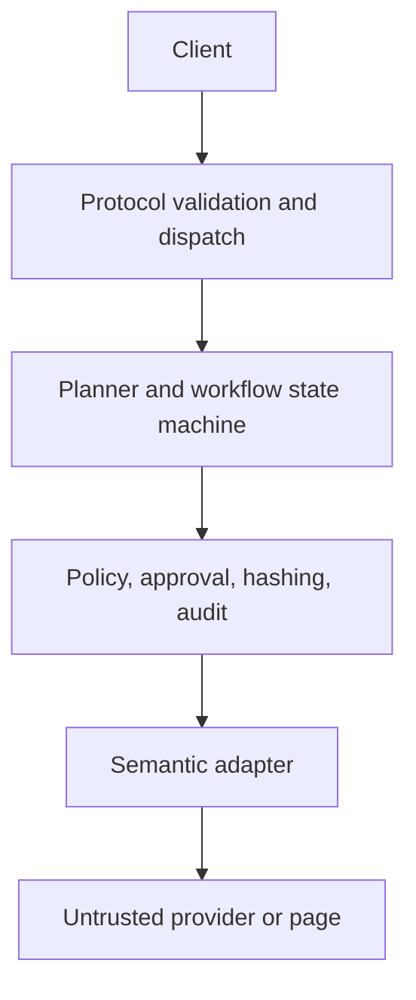

# ToolBraid architecture

This document explains the repository contract and the boundaries an operator
must preserve. It is not a statement that a hosted browser-automation service,
durable database, authentication gateway, or production observability stack is
included in this repository.

## Scope and public surface

ToolBraid is a dependency-free Node.js 20+ MCP control plane. Its public
surface is deliberately small:

| Tool | Purpose | Side effects |
| --- | --- | --- |
| `capabilities.search` | Find semantic capabilities | Read-only |
| `capabilities.describe` | Inspect one capability and its input contract | Read-only |
| `plan.propose` | Build a versioned workflow proposal | Read-only |
| `workflow.execute` | Run an approved workflow node | May mutate, only with trusted approval |
| `workflow.status` | Read workflow state and results allowed by policy | Read-only |
| `workflow.replay_readonly` | Re-run recorded read-only nodes | Read-only by contract |

The names above are the contract. A capability being discoverable does not
grant permission to use it, and a provider result is data rather than an
instruction to the control plane.

## Trust boundaries

The client, provider metadata, page content, adapter observations, and adapter
outputs are untrusted. Validation, policy, approval binding, canonical
argument hashing, and redaction are server-side responsibilities. A browser
demo or a page-side helper can demonstrate an adapter, but is never the trust
boundary and must not be treated as one.

## Request flow

1. A request is parsed and validated as one JSON-safe object. Malformed input
   fails closed with the shared error shape (`code`, `message`, `retryable`, and
   optional `details`).
2. Identity is carried explicitly as tenant, subject/user, and workflow
   context. The process must not infer a tenant or user from global mutable
   state.
3. Discovery and proposal operations return data. A proposal is versioned so
   that the approval decision can be tied to exactly what was proposed.
4. Execution checks policy and, for a mutating node, a trusted server-side
   approval. The approval is bound to tenant, subject, workflow, revision, node,
   origin, adapter, canonical argument hash, expiry, and a single-use nonce.
5. The workflow state machine records the permitted transition. The required
   happy path is `draft -> proposed -> running -> awaiting_approval -> running
   -> completed`; `failed` and `cancelled` are terminal alternatives.
6. Read-only replay selects recorded read-only nodes only. It must not turn a
   recorded mutation into a new mutation or use replay as an approval bypass.

## Adapter model

Adapters expose semantic capabilities such as “read order” or “submit form”.
The intended preference order is structured API, WebMCP, DOM/accessibility,
then vision as a last resort. Fallback changes how an allowed capability is
implemented; it must not widen the capability, skip validation, or silently
change the approval binding.

Raw click, shell, arbitrary JavaScript, cookie access, filesystem browsing,
and policy-bypass primitives are not public capabilities. New adapters should
return typed, JSON-safe observations and should treat all page/provider content
as hostile input.

## Data and state

- Canonical argument serialization is used before hashing; semantically
  different arguments must not collide, and equivalent arguments should hash
  consistently.
- Audit events are append-only at the control-plane interface and redact
  secret-like keys. Storage durability, retention, encryption, and access
  controls are deployment responsibilities unless explicitly supplied by the
  runtime configuration.
- Workflow state is keyed by explicit identity. Do not share an in-memory
  runtime between tenants without an isolation design and tests that prove it.
- Outputs remain JSON-safe. Do not place credentials, cookies, bearer tokens, or
  raw page secrets in status responses or logs.

## Extension rules

When adding a capability or adapter:

1. Give it a stable semantic identifier and a narrow input/output schema.
2. Define whether it is read-only or mutating and which origin(s) it can reach.
3. Enforce identity, policy, and approval checks at the server-side broker.
4. Include canonical-argument and replay tests, including malformed and
   adversarial provider data.
5. Update the threat-control matrix and operator runbook with any new external
   dependency or required deployment control.

The source and tests are the authoritative implementation evidence. If this
document and the running implementation disagree, stop the release and resolve
the discrepancy rather than assuming the broader behavior is safe.
