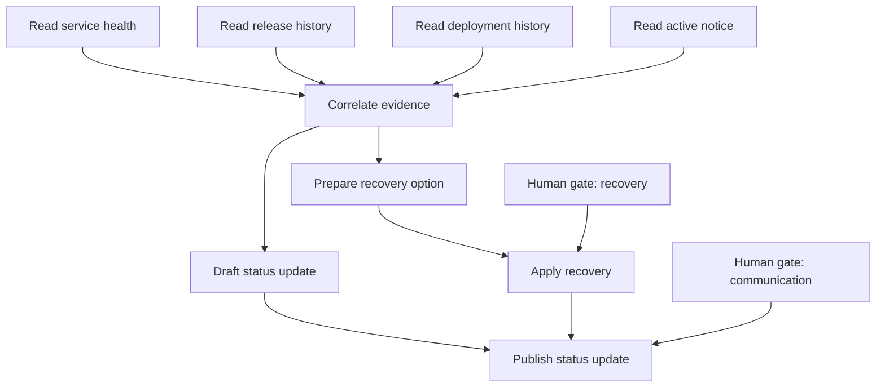

# ToolBraid Architecture

## System boundary

ToolBraid is a browser-native control plane. Provider websites deliberately expose capabilities through WebMCP; ToolBraid composes those capabilities without importing provider implementation code or collecting their credentials.

The engine is provider-neutral. Recovery vocabulary lives in a replaceable domain pack.

[](diagrams/toolbraid-how-it-works.svg)

```text
human objective
  -> discover live tools from allowed origins
  -> scan and quarantine untrusted metadata
  -> normalize contracts into canonical capabilities
  -> build an explainable dependency graph
  -> execute safe evidence collection
  -> finalize exact mutation arguments
  -> obtain separate human approvals
  -> refresh live registry and atomically claim both approvals
  -> apply recovery, then publish only after apply succeeds
  -> seal the local integrity chain
```

## Runtime modes

### Native WebMCP

The orchestrator on port 4173 mounts six sandboxed provider documents from ports 4174 through 4179. Each provider makes literal asynchronous calls to:

```js
document.modelContext.registerTool(definition, {
  exposedTo: [orchestratorOrigin],
  signal: lifecycle.signal
});
```

The orchestrator calls `getTools({ fromOrigins })`, retains each opaque live registration, and passes that exact object to `executeTool()`. Origin, name, normalized input schema, and registration generation form tool identity.

[](diagrams/toolbraid-cross-origin-architecture.svg)

### Local verification harness

When native WebMCP is unavailable on localhost, ToolBraid creates an in-memory catalog with the same observable registration, exposure, discovery, execution, cancellation, and tool-change rules. The UI labels this mode **Verified local harness**. It is for deterministic development and E2E validation, not native compliance evidence.

Outside localhost/file origins, an unsupported native API fails closed.

## Modules

| Layer | Files | Responsibility |
|---|---|---|
| WebMCP boundary | `src/engine/webmcp.js` | native client, local registry, origin exposure, live tool identity, cancellation, registry generation |
| Security and semantics | `src/engine/risk.js`, `normalizer.js` | metadata quarantine, capability scoring, schema fingerprints, ranked alternatives |
| Planning and execution | `src/engine/graph.js`, `executor.js` | DAG lifecycle, concurrent safe work, read-only fallback, fail-closed mutations |
| Authority and evidence | `src/engine/approval.js`, `audit.js` | exact approval envelopes, nonce claims, replay rejection, SHA-256 chain |
| Domain pack | `src/packs/recovery/` | seven capabilities, aliases, canonical results, nine-node two-stage recovery graph |
| Providers | `providers/recovery/` | six independent native documents and deterministic state |
| Application | `src/app/` | mission controller, UI state projection, constellation, approvals, receipts, audit inspector |

## Recovery capability pack

| Capability | Policy |
|---|---|
| `service.health.read` | read-only; primary plus fallback |
| `release.history.read` | read-only |
| `deployment.history.read` | read-only |
| `recovery.option.prepare` | reversible preparation; cannot alter production |
| `recovery.option.apply` | external mutation; human approval required |
| `status.notice.read` | read-only |
| `status.notice.publish` | external mutation; separate human approval required |

Provider contracts deliberately use unfamiliar names, fields, and result shapes. Adapters branch on canonical capability, never provider name.

## Two-stage graph



The four evidence reads run concurrently. A failed primary health read may use a mapped read-only alternative. No mutating node automatically retries or changes provider.

The initial graph defers mutation arguments. Only completed evidence, the prepared recovery quote, current notice revision, and drafted message can finalize those arguments. Approval is therefore bound to concrete values rather than placeholders.

## Approval and execution

Each approval envelope binds:

- version, plan ID, and revision;
- node and canonical capability;
- exact origin, tool name, and SHA-256 schema fingerprint;
- normalized arguments and effect summary;
- risk, issued/expiry times, and one-time nonce.

Approval creation is a top-level trusted DOM action and is absent from the public automation surface. Before any mutation, ToolBraid refreshes and rescans both live tools, then verifies and claims the complete approval set synchronously. Recovery applies first; publication cannot start unless recovery succeeds. A failed claim consumes nothing. Once claimed, failure does not release a nonce, and any partial outcome is retained in a sealed local record.

## Audit

Every discovery, quarantine, mapping, node lifecycle, provider attempt, fallback, plan finalization, approval, claim, execution, invalidation, and completion event is appended to an in-memory SHA-256 hash chain. Each entry includes the previous hash. Mission completion or partial mutation failure seals the entry count and head hash. This detects edits inside the retained local record; it is not a signed, durable, or externally anchored audit log.

## Origin policy

The multi-origin server applies explicit `Permissions-Policy`, CSP `frame-src`, provider `frame-ancestors`, sandboxing, path allowlists, no-store caching, and no provider network access. The app sends only capability-required fields to each provider.

See [Native WebMCP Contract](competition/native-webmcp-contract.md) for the pinned API behavior.
