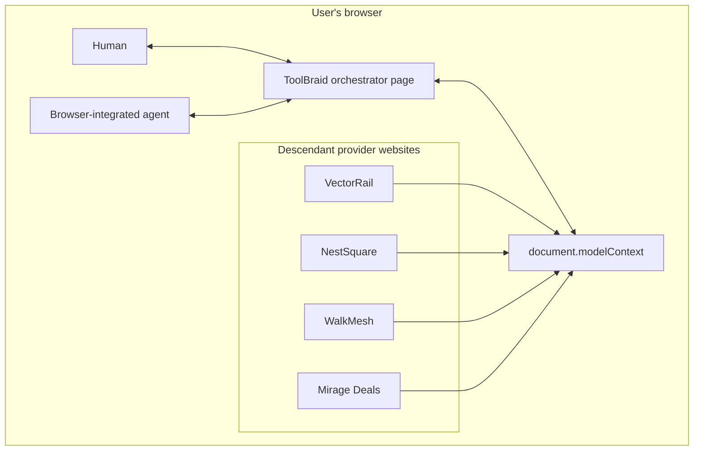
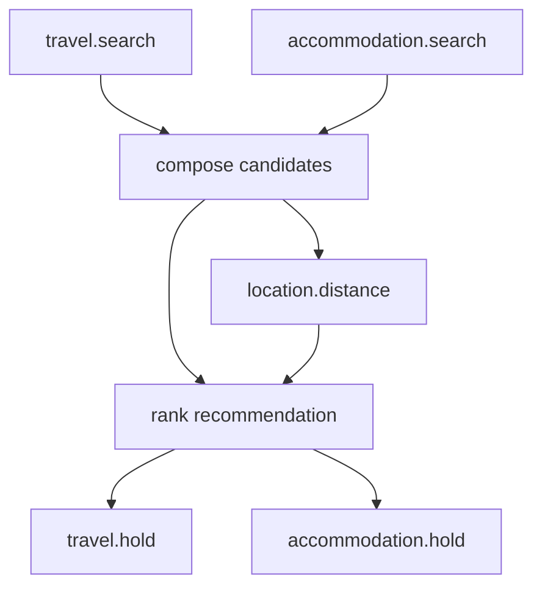
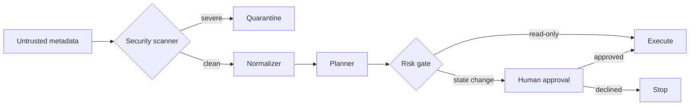

# ToolBraid Architecture

## 1. Design decision

ToolBraid is a **browser-native control plane**, not a backend broker.

That decision aligns the product with WebMCP's core value: tools execute inside a visible web application, reuse its client-side logic and current state, and preserve human-agent collaboration. The challenge demo is therefore a static application containing an orchestrator page and independent provider pages.

## 2. Runtime topology



Provider tools are registered from iframe documents with an `exposedTo` option. The orchestrator discovers descendant tools through `getTools()`. In the same-origin challenge fixture, this demonstrates the browser composition model without a remote service or credential transfer.

## 3. Component model

### 3.1 WebMCP runtime

File: `js/core/webmcp-runtime.js`

Responsibilities:

- detect a native `document.modelContext` implementation;
- call `document.modelContext.registerTool()` directly in native mode;
- provide `getTools()` and `executeTool()` wrappers;
- provide a local test implementation when native support is unavailable;
- preserve tool ownership by frame;
- enforce origin visibility in the test runtime;
- propagate cancellation signals;
- notify contexts when tools change.

The local runtime is not presented as a replacement standard. It exists to make development, CI, and ordinary-browser evaluation deterministic.

### 3.2 Provider applications

Files: `providers/*.html`, `providers/*.js`

Each provider owns:

- its visible UI;
- its tool definitions and JSON schemas;
- its in-memory data and state changes;
- its WebMCP registration;
- visual activity updates when a tool executes.

ToolBraid never imports private provider functions. It interacts only through the tool contract.

### 3.3 Discovery and security scan

Files: `js/app.js`, `js/core/risk.js`

Process:

1. call `getTools()`;
2. remove ToolBraid's own `toolbraid.*` namespace;
3. scan name, title, and description for instruction-like content;
4. quarantine severe findings before planning;
5. retain provider annotation evidence for the inspector.

### 3.4 Semantic normalizer

Files: `js/core/ontology.js`, `js/core/text.js`, `js/core/normalizer.js`

The normalizer scores each discovered tool against canonical capabilities using:

- semantic tokens in tool name;
- semantic tokens in title;
- description cues;
- input-schema property cues;
- intent phrases;
- mutation/read-only penalties;
- separation from the next-best capability.

The output is an explainable mapping record:

```json
{
  "tool": "nestsquare.scan_spaces",
  "capability": "accommodation.search",
  "confidence": 0.91,
  "evidence": [
    "semantic cues in tool name",
    "description cues",
    "compatible schema fields"
  ],
  "risk": "read-only",
  "quarantined": false
}
```

This MVP deliberately uses deterministic scoring. It is inspectable, offline, fast, and testable. A production version can add embeddings or an LLM classifier as another evidence source, not as an opaque replacement.

### 3.5 Schema adapters

File: `js/core/adapters.js`

Input adaptation maps canonical concepts to whichever property names a provider declares. Examples:

```text
origin → from | start | leaving | departure
travelOptionId → quoteId | journeyId | ticketId | optionId
accommodationOptionId → spaceCode | roomId | propertyId
```

Output canonicalization locates provider arrays and normalizes IDs, labels, prices, addresses, times, distance, and hold metadata.

No adapter branches on provider name. Branches are by canonical capability.

### 3.6 Planner

File: `js/core/planner.js`

The trip plan is a dependency graph:



Properties:

- travel and accommodation search can run concurrently;
- local composition waits for both;
- access measurement receives the shortlisted stays;
- ranking waits for price and access evidence;
- both hold actions depend on the final recommendation;
- risk classification automatically makes hold nodes approval-gated.

The planner fails closed with `CAPABILITY_GAP` when any required capability is absent.

### 3.7 Executor

File: `js/core/executor.js`

`runPlanUntilBlocked()` repeatedly finds runnable nodes whose dependencies are complete. Independent nodes execute concurrently. Each node passes through:

```text
pending → running → completed
                 ↘ failed
pending → approved → running → completed   (approval-gated only)
```

The safe-execution mode never includes approval nodes. Approved execution requires both:

1. the node status is `approved`; and
2. a human approval record exists in application state.

### 3.8 Human approval boundary

File: `js/app.js`

The agent-facing tool `toolbraid.execute_approved_actions` cannot create an approval. It only consumes an approval record generated by a human UI event. Without that record it returns `approval_required`, opens the approval surface, and executes nothing.

Approval records contain:

- source: human;
- channel;
- selected node IDs;
- timestamp.

### 3.9 Audit and explainability

File: `js/core/audit.js`

The audit records discovery, plan creation, input adaptation, node lifecycle, results, provider UI updates, approval, and failures. The UI exposes three live views:

- **Mappings:** semantic evidence and confidence;
- **Audit:** ordered execution trace;
- **State:** serializable product snapshot.

## 4. ToolBraid's agent contract

The orchestrator registers four WebMCP tools.

### `toolbraid.plan_mission`

Read-only. Accepts a natural-language goal plus optional structured constraints. Returns the plan and mapping state.

### `toolbraid.execute_safe_steps`

Read-only. Runs only safe nodes and returns the pending approval actions.

### `toolbraid.execute_approved_actions`

State changing. Executes only already approved nodes. Cannot self-approve.

### `toolbraid.inspect_state`

Read-only. Returns a redacted, serializable snapshot for agent inspection.

## 5. Security boundaries



Provider descriptions never become instructions to the orchestrator. They are scored as untrusted data. Tool outputs remain provider data and should receive stricter schema validation in production.

## 6. Deployment architecture

The application is static and can be deployed to GitHub Pages, Cloudflare Pages, Netlify, Vercel, Render, or ChatGPT Sites.

The repository includes `.github/workflows/pages.yml` for GitHub Pages.

No server environment variables or secrets are required.

## 7. Testing architecture

### Pure module tests

Node's built-in test runner verifies:

- intent extraction;
- unknown-name normalization;
- low-signal rejection;
- metadata quarantine;
- DAG construction;
- dependency gating;
- missing-capability failure;
- provider-independent output composition;
- budget-aware ranking.

### Browser E2E

Playwright launches the real static app and verifies:

- all iframe providers register;
- six tools are discovered;
- one malicious tool is quarantined;
- five capabilities are available;
- safe execution completes five nodes;
- two actions remain pending;
- recommendation stays under budget;
- approval enables only selected reversible actions;
- both provider holds are created;
- no browser console errors occur.

## 8. Production extension points

- replace or augment deterministic scoring with an embedding/local-model plugin;
- maintain several ranked provider candidates per capability;
- retry idempotent reads and substitute providers;
- validate every input/output against JSON Schema;
- sign provider manifests and bind tool identity to origin;
- add compensation nodes for reversible actions;
- persist audit logs with tamper evidence;
- support policy packs and user preferences;
- use real multi-origin frames with strict origin allowlists.
