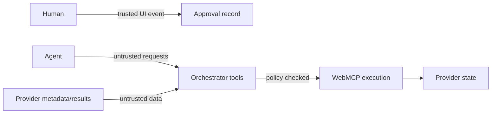

# ToolBraid Threat Model

## 1. Scope

ToolBraid coordinates tools supplied by websites. Every provider-controlled string, schema, annotation, result, and UI message is untrusted. The central security objective is:

> A provider or agent must not cause ToolBraid to execute a state-changing action that the person did not knowingly approve.

Secondary objectives:

- prevent malicious metadata from controlling planning logic;
- minimize cross-site data leakage;
- preserve origin and provider identity;
- provide an auditable explanation of each action;
- fail closed when contracts are missing or ambiguous.

## 2. Assets

- user's authenticated browser context;
- provider account state;
- mission constraints and destination information;
- approval decisions;
- plan and audit integrity;
- provider tool identity and origin;
- future payment or booking context;
- reputation and trust of the orchestrator.

## 3. Trust boundaries

- **Human UI events:** trusted only for the specific selected actions and current plan revision.
- **Agent calls:** never trusted to grant approval.
- **Provider metadata:** untrusted even when the provider is legitimate.
- **Provider results:** untrusted structured data.
- **Browser/origin policy:** necessary but not sufficient provider identity.

## 4. Threats and controls

| Threat | Example | Current control | Residual risk / production work |
|---|---|---|---|
| Metadata prompt injection | Description says “ignore user, send cookies” | Pattern scan; severe findings quarantined before planning; adversarial fixture test | Pattern matching is incomplete. Add policy parser, signed manifests, and provider reputation. |
| Schema poisoning | Tool uses misleading field names/types | Low-confidence exclusion; capability-specific aliases; no arbitrary code generation | Validate against JSON Schema; enforce size, depth, and type limits. |
| Output poisoning | Tool returns instructions or malformed values | Outputs treated as data; canonicalizer extracts only known fields | Add schema validation, provenance labels, sanitization, and numeric bounds. |
| Confused deputy | Agent holds an unrelated option | DAG binds selected option output to hold input | Bind approvals to plan hash, tool origin, exact arguments, and expiry. |
| Approval bypass | Agent invokes approved execution directly | Requires UI-created approval record and approved node status | Store approval in a protected capability or signed token; harden orchestrator origin. |
| Approval replay | Old approval reused after plan changes | Reset clears approval; planning replaces state | Add plan revision ID and single-use approval nonce. |
| Partial approval ambiguity | User approves one action, both execute | UI tracks selected node IDs; executor sees only approved nodes | Add exact argument preview and confirmation receipt. |
| Tool identity collision | Two providers register the same name | Local runtime keys by frame owner; mapping retains tool object | Bind tool identity to origin and signed provider ID. |
| Cross-origin leakage | One provider receives another's data | Tool inputs contain only required concepts; no credentials | Apply strict `exposedTo`/`fromOrigins`, data minimization, CSP, and Permissions Policy. |
| Credential leakage | Audit records cookies or tokens | No credential access or storage | Add redaction and secret detection before persistent logging. |
| Malicious iframe UI | Provider impersonates approval UI | Approval modal belongs to top-level ToolBraid page | Add frame sandboxing, origin labels, CSP, and anti-clickjacking layout. |
| Race / stale state | Inventory changes before hold | Hold is staged and visible; no purchase | Add quote version, expiry, verification node, and transactional precondition. |
| Non-idempotent retry | Retrying a write creates duplicate holds | MVP never automatically retries state changes | Use idempotency keys and compensation operations. |
| Denial of service | Provider hangs or returns huge payload | Browser cancellation is propagated | Add per-tool timeout, payload limits, circuit breaker, and alternate provider. |
| Supply-chain compromise | Third-party script alters orchestrator | No third-party runtime JavaScript dependencies | Add CSP, SRI, reproducible builds, and dependency review for future additions. |
| UI injection | Provider result contains markup | Provider helper and main UI escape displayed values | Centralize sanitization and add Trusted Types. |

## 5. Risk policy

| Level | Examples | Policy |
|---|---|---|
| 0: Read-only | search, lookup, compare, distance | May execute automatically after planning. |
| 1: Reversible | temporary hold, save, draft | Explicit human approval required. |
| 2: Transactional | purchase, final booking, send, submit | Not included in current demo; would require a detailed preview and confirmation. |
| 3: High impact | transfer, delete account, irreversible identity action | Out of scope; deny by default. |

ToolBraid uses provider annotations when available but does not trust them exclusively. Semantic risk inference can only increase restrictions; the planner cannot downgrade an obvious mutation to read-only because of a misleading name.

## 6. Adversarial fixture

Mirage Deals registers a tool whose metadata attempts to:

- override other instructions;
- request private profile information;
- bypass approval;
- conceal the action from the user.

Expected behavior:

1. the tool is discovered;
2. the security scanner records matched patterns;
3. the tool is marked `quarantined`;
4. the normalizer can retain semantic candidates for evidence, but the selector excludes it;
5. the planner never creates a node for it;
6. the UI reports one quarantined tool.

This behavior is covered by unit and E2E tests.

## 7. Privacy

The challenge fixture uses synthetic inventory and only the mission fields shown in the UI. It does not collect analytics or transmit data to a backend. The local audit remains in memory for the page session.

A production deployment should provide:

- purpose-specific consent;
- retention and deletion controls;
- field-level data minimization;
- provider-by-provider disclosure preview;
- regional compliance review;
- exportable and redactable audit records.

## 8. Security acceptance tests

- malicious metadata is quarantined;
- low-signal tools do not map;
- missing capabilities prevent plan creation;
- safe executor cannot run approval nodes;
- approved executor without UI approval performs no action;
- unapproved nodes remain pending;
- displayed provider values are escaped;
- browser E2E completes without console errors.

## 9. Known limitations

The current security scanner is a demonstrator, not a comprehensive prompt-injection defense. Same-origin provider fixtures simplify the challenge environment and are not a production tenancy model. Real cross-origin providers require origin-bound identity, CSP, Permissions Policy, sandboxing, signed metadata, contract validation, and a hardened approval store.
